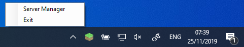

# Super Simple Minecraft Server Manager

## Introduction

> A super simple windows app that minimises to the task bar to allow for easy MC server hosting on Windows

## Screenshots

## Installation

1. Grab the latest release, from the releases tab and place in the same folder as your Minecraft server.
2. Update the cmd.txt with any command line settings you'd like to change. 
3. Fire up the program and click start.

Please Not that the ONLY way to exit the program is to right click the icon in the task bar and click exit. Clicking 'X' in the UI purely minimises to the task bar. 

## Acknowledgements
[MedallionShell](https://github.com/madelson/MedallionShell)

[Material Design In XAML Toolkit](https://github.com/MaterialDesignInXAML/MaterialDesignInXamlToolkit)
